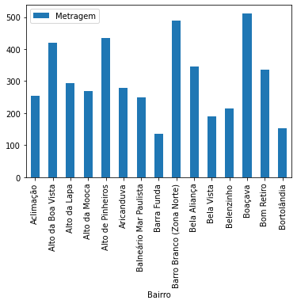

# Imersão Dados #4 Alura

### [Aula 01 - Seu primeiro Colab com Python e Pandas](ALURA_IMERSÃO_DADOS_4_Aula_01.ipynb)

Resumo da aula: Primeiros passos utilizando Google Colab como notebook e a Biblioteca Pandas para analisar um banco de dados de imóveis da cidade de São Paulo. Foi possível realizar algumas análises e gráficos simples como o mostrado abaixo com a média da Metragem dos imóveis por Bairro da cidade.

### Aula 2 - Tratamento de dados e primeiros gráficos

Resumo da aula: .

### Aula 3 - Gráficos, Time Series e Análise Exploratória

Resumo da aula: Em breve.

### Aula 4 - Missão Impossivel: Cruzando bases de Dados

Resumo da aula: Em breve.

### Aula 5 - Machine Learning

Resumo da aula: Em breve.

### Conclusão
